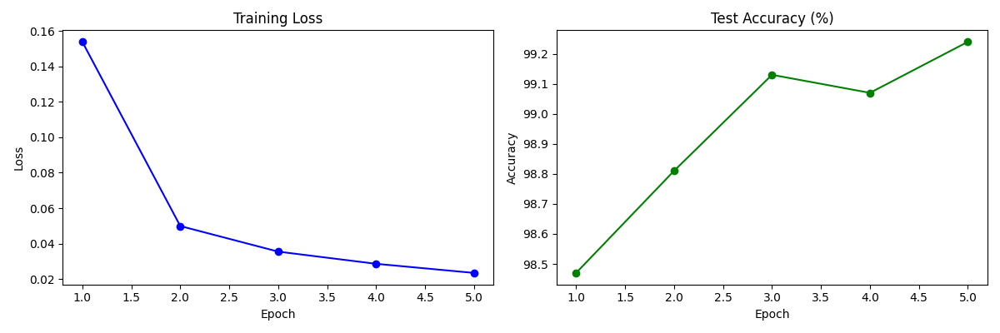

# Digit Classifier

A handwritten digit classifier built end-to-end — from training a neural network from scratch to deploying it as an interactive web app.

**[Try it live →](https://digit-classifier-ten.vercel.app)**

Draw any digit (0–9) on the canvas and the neural network predicts it in real time, with confidence scores for every digit.

---

## How it works

1. **Draw** a digit on the canvas
2. The drawing is **cropped and centered** automatically to match the training data format
3. It's **scaled down to 28×28 pixels** and normalized
4. The **neural network runs entirely in the browser** (no server, no API call)
5. You see the **prediction and confidence scores** instantly

---

## Tech Stack

| Layer | Tech |
|---|---|
| Model training | Python, PyTorch |
| Dataset | MNIST (60,000 training images) |
| Model export | ONNX |
| Browser inference | ONNX Runtime Web |
| Frontend | React |
| Deployment | Vercel |

---

## Model Architecture

A Convolutional Neural Network (CNN) trained from scratch on the MNIST dataset.

```
Input (1×28×28)
  → Conv2d(1, 32, 3×3) + ReLU + MaxPool2d(2)
  → Conv2d(32, 64, 3×3) + ReLU + MaxPool2d(2)
  → Flatten
  → Linear(3136, 128) + ReLU + Dropout(0.25)
  → Linear(128, 10)
Output (10 class scores)
```

**Training results:**
- Training images: 60,000
- Test images: 10,000
- Epochs: 5
- Final test accuracy: **99.24%**

---

## Training Curves



---

## Run locally

**Train the model (Python)**
```bash
git clone https://github.com/itsnotvii/digit-classifier.git
cd digit-classifier

python3 -m venv venv
source venv/bin/activate
pip install torch torchvision onnx onnxscript numpy matplotlib

python train.py       # trains and saves digit_model.pth
python convert.py     # exports to digit_model.onnx
```

**Run the frontend (React)**
```bash
cd frontend
npm install
cp ../digit_model_single.onnx public/
npm start
```

Open [http://localhost:3000](http://localhost:3000)

---

## Project Structure

```
digit-classifier/
├── train.py                  # CNN training script
├── convert.py                # PyTorch → ONNX conversion
├── digit_model.pth           # trained PyTorch weights
├── digit_model_single.onnx   # browser-ready model
├── training_curves.png       # loss and accuracy graphs
└── frontend/
    ├── src/
    │   └── App.js            # React app with canvas + inference
    └── public/
        └── digit_model_single.onnx
```

---

## What I learned

- How convolutional neural networks work and why they're suited for image tasks
- The full ML pipeline: data loading → training → evaluation → export → deployment
- How to run model inference client-side in the browser using ONNX Runtime Web
- Why preprocessing matters — auto-centering the drawing significantly improved real-world accuracy compared to the training distribution
